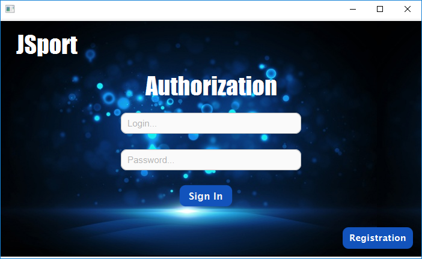
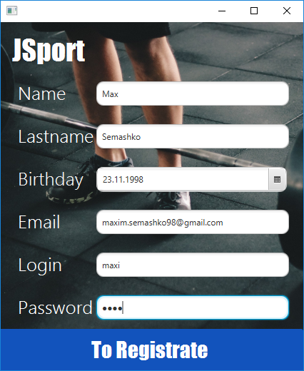
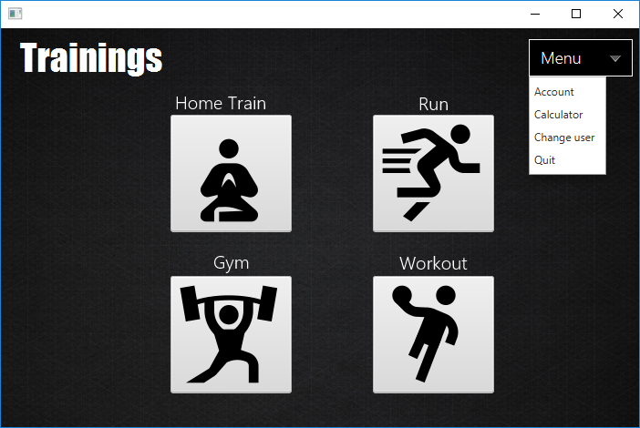
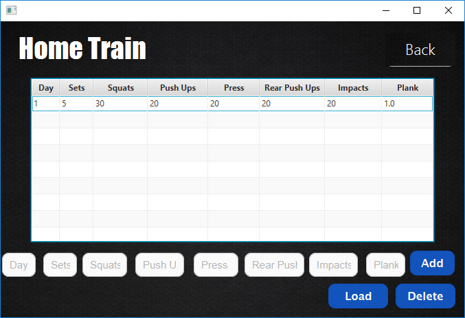
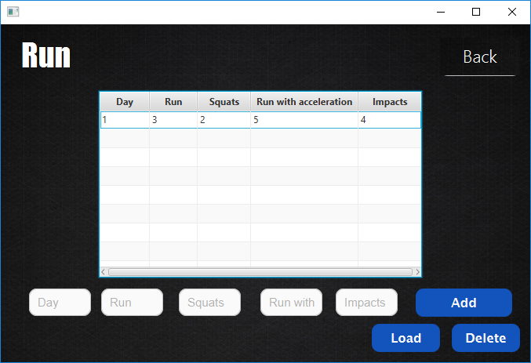
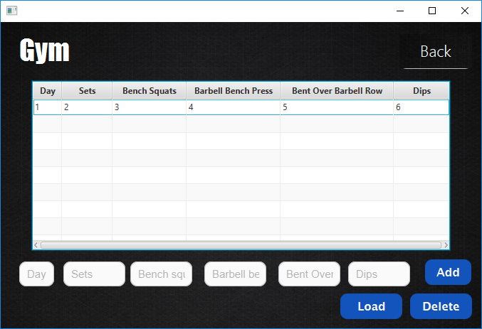
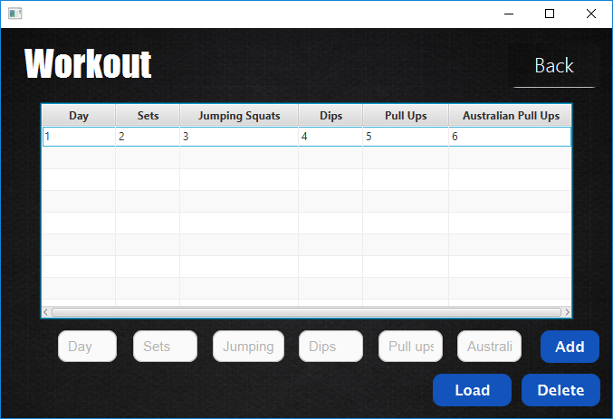
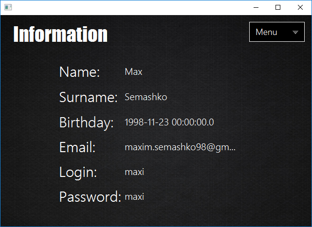
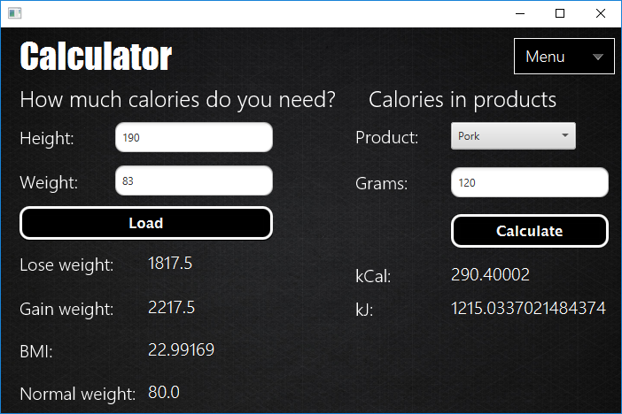

# JSport
JSport - these is app for sportmens.

I realize authorithation in app. All date stored in database(i use MySQL). For front i use SceneBuilder.

Here you can add information about progress in different trainings, that i make by myself:

Also you can see information about yourself

Calculate calories.

